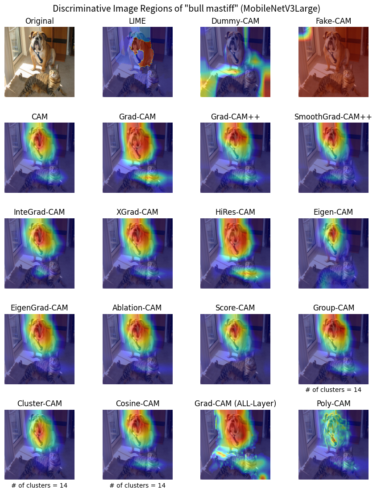
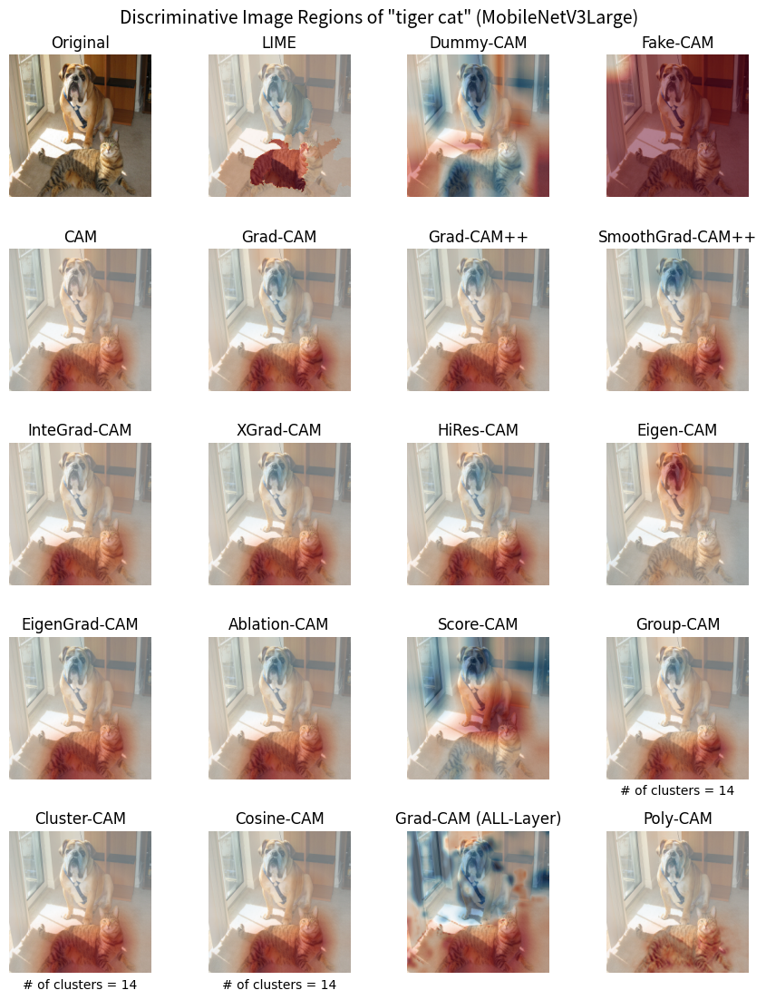

# class_activation_mapping

PyTorch implementation of various CAM (Class Activation Mapping) models
using TorchVision pre-trained CNN Classifiers.

## Supported TorchVision pre-trained CNN Classifiers

* [MobineNet V3](https://pytorch.org/vision/stable/models/mobilenetv3.html)
* [VGG](https://pytorch.org/vision/stable/models/vgg.html)
* [ResNet](https://pytorch.org/vision/stable/models/resnet.html)

## Implemented CAM Models

* Dummy-CAM
    * Original Implementation (simply average Activation over channels)
* Fake-CAM
    * S. Poppi, et al. "[Revisiting The Evaluation of Class Activation Mapping for Explainability: A Novel Metric and Experimental Analysis](https://arxiv.org/abs/2104.10252)" CVPR 2021.
* CAM (Vanilla-CAM)
    * B. Zhou, et al. "[Learning Deep Features for Discriminative Localization](https://arxiv.org/abs/1512.04150)" CVPR 2016.
* Grad-CAM
    * R. Selvaraju, et al. "[Grad-CAM: Visual Explanations from Deep Networks via Gradient-based Localization](https://arxiv.org/abs/1610.02391)" ICCV 2017.
* Grad-CAM++
    * A. Chattopadhyay, et al. "[Grad-CAM++: Improved Visual Explanations for Deep Convolutional Networks](https://arxiv.org/abs/1710.11063)" WACV 2018.
* Smooth Grad-CAM++
    * D. Omeiza, et al. "[Smooth Grad-CAM++: An Enhanced Inference Level Visualization Technique for Deep Convolutional Neural Network Models](https://arxiv.org/abs/1908.01224)" IntelliSys 2019.
* XGrad-CAM
    * R. Fu, et al. "[Axiom-based Grad-CAM: Towards Accurate Visualization and Explanation of CNNs](https://arxiv.org/abs/2008.02312)" BMVC 2020.
* IntegratedGrad (InteGrad-CAM)
    * M. Sundararajan, et al. "[Axiomatic Attribution for Deep Networks](https://arxiv.org/abs/1703.01365)" ICML 2017.
* HiRes-CAM
    * R. Draelos, et al. "[Use HiResCAM instead of Grad-CAM for faithful explanations of convolutional neural networks](https://arxiv.org/abs/2011.08891)" arXiv 2020.
* Eigen-CAM
    * M. Muhammad, et al. "[Eigen-CAM: Class Activation Map using Principal Components](https://arxiv.org/abs/2008.00299)" IJCNN 2020.
* Ablation-CAM
    * H. Ramaswamy, et al. "[Ablation-CAM: Visual Explanations for Deep Convolutional Network via Gradient-free Localization](https://openaccess.thecvf.com/content_WACV_2020/html/Desai_Ablation-CAM_Visual_Explanations_for_Deep_Convolutional_Network_via_Gradient-free_Localization_WACV_2020_paper.html)" WACV 2020.
* Score-CAM
    * H. Wang, et al. "[Score-CAM: Score-Weighted Visual Explanations for Convolutional Neural Networks](https://arxiv.org/abs/1910.01279)" CVF 2020.
* Group-CAM
    * Q. Zhang, et al. "[Group-CAM: Group Score-Weighted Visual Explanations for Deep Convolutional Networks](https://arxiv.org/abs/2103.13859)" arXiv 2021.
* Cluster-CAM
    * Z. Feng, et al. "[Cluster-CAM: Cluster-Weighted Visual Interpretation of CNNs' Decision in Image Classification](https://arxiv.org/abs/2302.01642)" arXiv 2023.
* Cosine-CAM
    * Original Implementation
* Poly-CAM
    * A. Englebert, et al. "[Poly-CAM: High resolution class activation map for convolutional neural networks](https://arxiv.org/abs/2204.13359)" ICPR 2022.

## Usage

see [usage.ipynb](ipynb/usage.ipynb)

## Commentaries for each CAM model

see [cam.ipynb](ipynb/cam.ipynb) (written in Japanese)

## Sample of heatmaps generated by each CAM model

